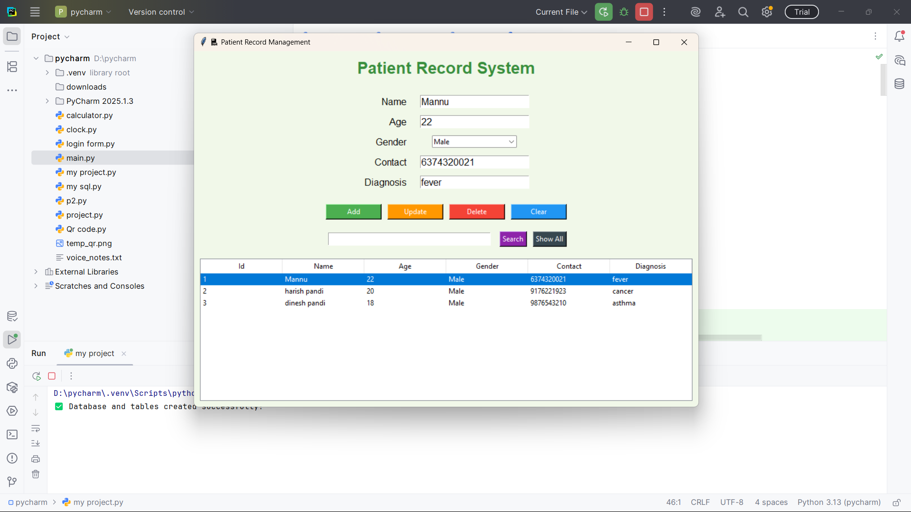
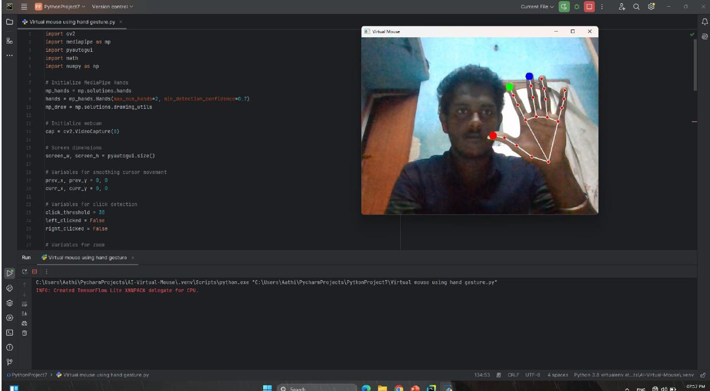

<!DOCTYPE html>

<head>
    <meta charset="UTF-8">
    <meta name="viewport" content="width=device-width, initial-scale=1.0">
    <title>My Potfolio</title>
    <link rel="stylesheet" href="style.css">
    
    <link rel="stylesheet" href="https://cdnjs.cloudflare.com/ajax/libs/font-awesome/7.0.0/css/all.min.css"
        integrity="sha512-DxV+EoADOkOygM4IR9yXP8Sb2qwgidEmeqAEmDKIOfPRQZOWbXCzLC6vjbZyy0vPisbH2SyW27+ddLVCN+OMzQ=="
        crossorigin="anonymous" referrerpolicy="no-referrer" />
    
</head>

<body>
    

        

            <nav>
                
                <ul id="sidemenu">
                    <li><a href="#header">Home</a></li>
                    <li><a href="#about">About</a></li>
                    <li><a href="#services">Services</a></li>
                    <li><a href="#portfolio">Protfolio</a></li>
                    <li><a href="#contact">Contact</a></li>
                    <i class="fa-solid fa-xmark" onclick="closemenu()"></i>
                </ul>
                <i class="fa-solid fa-bars" onclick="openmenu()"></i>
            </nav>
            

                
FRONTEND DEVELOPER

                <h1>Hi, I'm Manoj Ramesh , From Madurai, Tamil Nadu</h1>
            

        

    

    <!---- ------------------about-------- -->
    

        

            

                

                    
                

                

                    <h1 class="sub-title">About Me</h1>
                    
Hello! I'm [Manoj.R], a passionate and dedicated developer with a keen interest in building
                        impactful digital solutions. I specialize in Python, Web Development, and UI/UX Design, with
                        hands-on experience in tools like Tkinter, MySQL, Pygame, and modern front-end technologies.

                        I enjoy turning complex problems into simple, beautiful, and intuitive designs. Whether it’s
                        developing a robust Hospital Management System, designing an engaging Food delivery app, or
                        crafting responsive websites, I aim to deliver quality and innovation in every project.

                        I’m a quick learner, a strong team player, and always eager to explore new technologies and
                        ideas. My goal is to keep growing as a developer while contributing to meaningful projects that
                        make a difference.
                    

                    

                        
Skills

                        
Experience

                        
Education

                    

                    

                        <ul>
                            <li>WEB DEVELOPMENT(HTML,CSS) Responsive, interactive design</li>
                            <li>UI/UX Designing Web/App Interfaces</li>
                            <li>PYTHON Versatile, backend logic</li>
                            <li>MY SQL Efficient data management</li>
                        </ul>
                    

                    

                        <ul>
                            <li>08/07/2024 - 10/08/2024 Internship for Mobile Application Development at
                                Wizinoa</li>
                            <li>18/01/2024 - 03/02/2024 Internship for Technology job simulation at
                                deloitte</li>
                            <li>22/06/2023 - 05/07/2023 Internship for Web development at WebGapp</li>
                        </ul>
                    

                    

                        <ul>
                            <li>2021 - 2025  BE/CSE from Fatima Michael College Of Engineering and
                                Technology</li>
                            <li>2020 - 2021 12 th Grade from Subramaniya Bharathi Mt.Hr.Sec.School</li>
                            <li>2018 - 2019 10 th Grade from Sri Sundareshwara Vidya Sala
                                Mt.Hr.Sec.School</li>
                            <li>Sep/2020 - Feb/2021 Diploma in Computer Application from Vels Institute
                                Of Technology</li>
                        </ul>
                    

                

            

        

    

    <!-- -----------------services------------------------ -->
    

        

            <h1 class="sub-title">My Services</h1>
            

                

                    <i class="fa-solid fa-code"></i>
                    <h2>Web Development</h2>
                    
Crafting responsive and modern websites using HTML, CSS, JavaScript, and frameworks like React
                        and Django. Ensuring clean UI, fast performance, and mobile-friendly designs.

                    <a href="#">Learn More</a>
                

                

                    <i class="fa-brands fa-python"></i>
                    <h2>Python Development</h2>
                    
Design and develop dynamic, secure, and scalable web applications using Python frameworks like
                        Django and Flask. Ideal for custom dashboards, content management systems, APIs, and more.

                    <a href="#">Learn More</a>
                

                

                    <i class="fa-brands fa-app-store"></i>
                    <h2>App Design</h2>
                    
Design modern and user-friendly mobile and web applications using Figma. From wireframes to
                        high-fidelity prototypes, focusing on clean UI and smooth user experience.

                    <a href="#">Learn More</a>
                

                

                    <i class="fa-solid fa-crop-simple"></i>
                    <h2>UI/UX</h2>
                    
Turning ideas into beautiful, easy-to-use app and website designs! I use Figma to create smooth,
                        fun, and user-friendly experiences—from simple sketches to clickable prototypes that feel real.
                    

                    <a href="#">Learn More</a>
                

            

        

    

    <!-- ------------portfolio------------------- -->
    

        

            <h1 class="sub-title">My Work</h1>
            

                

                    
                    

                        <h3>Hospital Management System</h3>
                        
Developed a full-featured desktop application using Python, Tkinter, and MySQL.

                            Modules include patient registration, doctor management, and

                            Focused on secure login, data handling, and real-time database integration.

                        <a href="#"><i class="fa-solid fa-arrow-up-right-from-square"></i></a>
                    

                

                

                    
                    

                        <h3>Food Delivery App</h3>
                        
Designed a modern and intuitive food delivery app interface.

                            Prioritized mobile-first design principles with clean, user-friendly layouts.

                            Tools used: Figma / Adobe XD for prototyping and user flow mapping.

                        <a href="#"><i class="fa-solid fa-arrow-up-right-from-square"></i></a>
                    

                

                

                    
                    

                        <h3>Virtual Mouse Using Hand Gestures</h3>
                        
Created a virtual mouse system using Python, OpenCV, and Mediapipe.

                            Enabled touchless control of the computer using hand gestures via webcam.

                            Aimed at enhancing accessibility and hands-free interaction.

                        <a href="#"><i class="fa-solid fa-arrow-up-right-from-square"></i></a>
                    

                

            

            <a href="" class="btn">See more</a>
        

    

    <!-- --------------------conctact-------------------- -->
    

        

            

                

                    <h1>Contact Me</h1>
                    
<i class="fa-solid fa-paper-plane"></i>manojramesh2808@gmail.com

                    
<i class="fa-solid fa-square-phone"></i>6374320021

                    

                        <a href="https://www.facebook.com/mersal.manoj.58726"><i class="fa-brands fa-facebook"></i></a>
                        <a href="https://www.instagram.com/__m_a__n__n__u__/?hl=en"><i
                                class="fa-brands fa-instagram"></i></a>
                        <a href="https://www.linkedin.com/in/manoj-r-1b7115282/"><i
                                class="fa-brands fa-linkedin"></i></a>
                    

                    <a href="image/Manoj CV-1.pdf" download class="btn btn2">Download CV</a>
                

                

                    <form name="submit-to-google-sheet">
                        <input type="text" name="Name" placeholder="Your Name" required>
                        <input type="email" name="Email" placeholder="Your Email" required>
                        <textarea name="Messages" rows="6" placeholder="Your Messages"></textarea>
                        <button type="submit" class="btn btn2">Submit</button>
                    </form>
                    
                

            

        

        

            
Copyright &copy; Manoj <i class="fa-solid fa-heart"></i>

        

    

    

    
    
</body>

</html>
